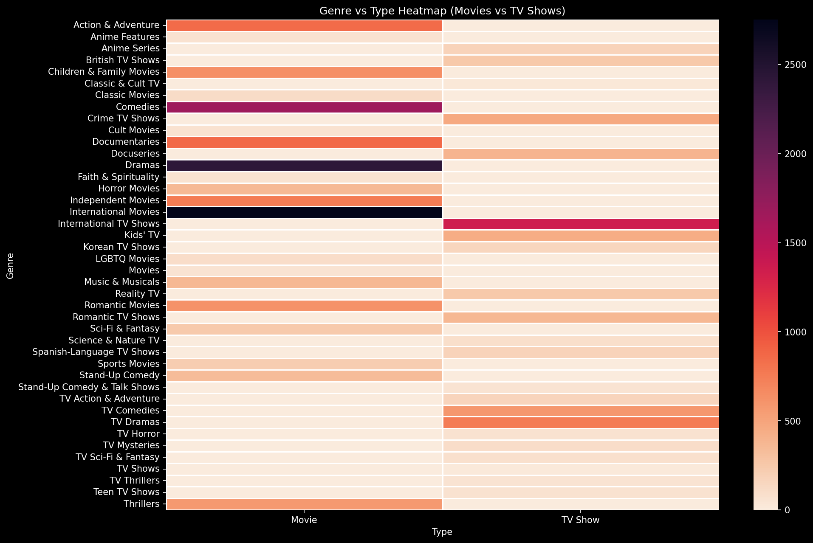

<h1 align="center">🎬 Netflix Movies & TV Shows — Exploratory Data Analysis</h1>

Python • Pandas • Matplotlib • Seaborn • WordCloud • Google Colab

  

## 📌 Overview
This project explores the Netflix Titles Dataset (~8.8k entries) using Exploratory Data Analysis (EDA).  
The goal is to understand **content distribution, genre dominance, ratings**, **release trends**, and **popular themes**.

## 📂 Contents
- `notebook/netflix_eda.ipynb` — Google Colab notebook  
- `visuals/` — All plots (PNG format)  
- Cleaned EDA with insights  
- WordCloud, Heatmaps, Genre-Analysis, and Trend graphs

---

## 🔍 Key Insights
- **70% Movies vs 30% TV Shows**
- Major **content surge after 2015**
- Top genres include:
  - Drama  
  - International Movies  
  - Comedies  
- **TV-MA** is the most common rating  
- WordCloud shows themes like *love, family, crime, action*

---

## 📊 Visuals Included
- Movies vs TV Shows  
- Release Year Trend  
- Genre Frequency  
- Genre vs Type Heatmap  
- Ratings Distribution  
- Top Directors (Unknown Removed)  
- WordCloud of Descriptions  
- Movie Duration Histogram  

---

## 🚀 Tools & Technologies
- Python  
- Pandas  
- NumPy  
- Matplotlib  
- Seaborn  
- WordCloud  
- Google Colab  

---

## ▶️ How to Run
1. Open the notebook in Google Colab  
2. Upload `netflix_titles.csv`  
3. Run all cells  
4. Visuals are saved automatically to PNG files  

---

## 📘 Author
**Nitesh Sharma**  
*Aspiring Data Scientist | Python & SQL | EDA Projects*
**www.linkedin.com/in/niteshscore/**

---

## ⭐ If you found this helpful:
Give the repo a star ⭐ and connect with me on LinkedIn!
